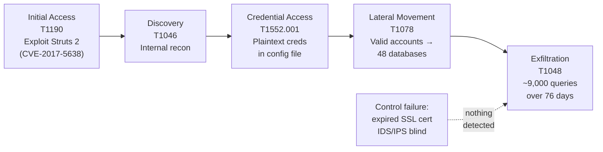

# Equifax 2017 Data Breach — Retrospective Cyber Risk Assessment


A structured, retrospective risk assessment of the **2017 Equifax data breach**, one of the largest breaches of personal data in history. It uses **NIST SP 800-30 Rev. 1** to identify the assets, threats, vulnerabilities and control gaps behind the breach, scores the top five risks, and recommends mitigations mapped to **NIST SP 800-53 Rev. 5** and **CIS Controls v8.1**, with residual risk ratings.

The central question: *if Equifax had run a structured risk assessment before May 2017, would the breach have been prevented?*

---

## At a Glance

| | |
|---|---|
| **Records exposed** | ~147.9M US consumers (names, DOBs, 145.5M SSNs), 209,000 payment cards, 182,000 dispute documents |
| **Initial access** | CVE-2017-5638 — Apache Struts 2 RCE (CVSS 9.8) on the internet-facing ACIS dispute portal |
| **Patch available** | 7 March 2017 — **67 days** before exploitation began |
| **Undetected dwell time** | **76 days** (13 May – 29 July 2017) |
| **Why it went unseen** | Expired SSL certificate on the traffic-inspection appliance left IDS/IPS blind for ~19 months |
| **Settlement** | At least $575M (up to $700M) with the FTC, CFPB and 50 US states/territories |

## Key Findings

All five risks identified scored **Critical** before treatment:

| ID | Risk | Inherent | Residual (after treatment) |
|----|------|:--------:|:-------------------------:|
| R1 | Unpatched Apache Struts 2 (CVE-2017-5638) | 🔴 25 Critical | 🟡 10 Medium |
| R2 | PII stored without encryption at rest | 🔴 20 Critical | 🟡 8 Medium |
| R3 | Plaintext credentials + flat network (lateral movement) | 🔴 20 Critical | 🟡 6 Medium |
| R4 | Expired certificate disabling traffic inspection | 🔴 25 Critical | 🟢 5 Low |
| R5 | Weak database authentication (no MFA) | 🔴 20 Critical | 🟡 10 Medium |

**The single most impactful control would have been automated patch management with verification (NIST SI-2).** Without the initial exploitation of CVE-2017-5638, R2–R5 never materialise.

**The deepest failures were organisational, not technical.** Equifax had a scanning programme, a patch notification, an IDS and an inspection appliance — but no governance to confirm any of them actually worked.

## Attack Chain (MITRE ATT&CK)



## Repository Structure

```
equifax-breach-risk-assessment/
├── README.md
├── docs/
│   ├── 01-incident-overview.md            # Background, timeline, impact
│   ├── 02-methodology.md                  # NIST SP 800-30 process & scoring criteria
│   ├── 03-system-characterisation.md      # Scope, boundaries, asset register
│   ├── 04-threat-vulnerability-analysis.md# Threats, vulns, controls, CVEs, ATT&CK
│   ├── 05-risk-analysis.md                # Likelihood × impact, risk matrix
│   ├── 06-risk-register-and-treatment.md  # Full register, mitigations, residual risk
│   ├── 07-lessons-learned.md              # Discussion & conclusions
│   └── references.md
└── data/
    ├── asset-register.csv
    └── risk-register.csv                  # Machine-readable register (Excel / Power BI ready)
```

## Methodology Summary

| Step (NIST SP 800-30) | What was done |
|---|---|
| **1. Prepare** | Scoped to the ACIS dispute portal and connected data stores; 12-month horizon (Sep 2016 – Sep 2017) |
| **2. Conduct** | 9 assets scored for C/I/A; threat sources, events, vulnerabilities (CVE/CWE) and control gaps analysed; 5×5 likelihood × impact scoring |
| **3. Communicate** | Risk register linking each risk to assets, threats, controls and framework-mapped mitigations |
| **4. Maintain** | Ongoing monitoring built into each treatment (patch verification, certificate lifecycle, database activity monitoring) |

## Skills Demonstrated

- Risk assessment using **NIST SP 800-30** (asset, threat, vulnerability and control analysis)
- Quantitative risk scoring (5×5 likelihood × impact matrix) and residual risk evaluation
- Control mapping to **NIST SP 800-53 Rev. 5** and **CIS Controls v8.1**
- Threat mapping with **MITRE ATT&CK**, **CVE/CVSS** and **CWE**
- Risk register design and risk treatment decisions (mitigate / accept)
- Governance and regulatory analysis (FTC Act, GLBA Safeguards Rule, PCI DSS)
- Research and synthesis of primary sources (US House Oversight report, GAO, FTC, DOJ)

## Disclaimer

This is an independent, retrospective analysis based entirely on publicly available sources (listed in [references](docs/references.md)). It has no affiliation with Equifax. Scoring reflects the author's analytical judgement; information about Equifax's internal environment is limited to what was published in official reports.

---

**Author:** Sneha Sukumar · BSc (Hons) Cyber Security · [GitHub](https://github.com/SnehaSukumar29)
