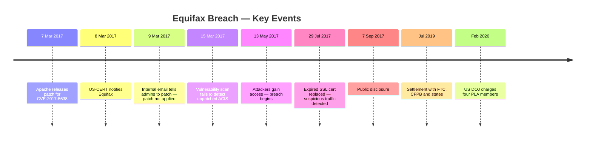

# 1. Incident Overview

[← Back to README](../README.md) · [Next: Methodology →](02-methodology.md)

## About Equifax

Equifax is a US multinational analytics and technology company specialising in consumer credit reporting. Together with Experian and TransUnion it forms the "Big Three" credit reporting agencies (CRAs), collecting financial data on individuals and businesses so lenders can make credit decisions. It also sells fraud prevention and identity protection services.

That business model makes the breach especially serious: Equifax holds highly sensitive data on people who never chose to become its customers.

## What Happened

Attackers exploited **CVE-2017-5638**, a remote code execution vulnerability in **Apache Struts 2**, the open-source web framework running Equifax's online consumer dispute portal (**ACIS**). By injecting a malicious OGNL expression into the `Content-Type` header of an HTTP request, they could make the server execute arbitrary commands. The underlying weakness is classified as **CWE-755** (Improper Handling of Exceptional Conditions).

A fix had been published two months earlier. The breach happened because of a series of missed opportunities, not a lack of information.

## Timeline

| Date | Event |
|------|-------|
| **7 March 2017** | Apache releases a patch for CVE-2017-5638 |
| **8 March 2017** | US-CERT notifies Equifax of the vulnerability |
| **9 March 2017** | Internal email instructs administrators to apply the patch — it is not applied to ACIS |
| **15 March 2017** | Vulnerability scan runs but fails to detect the unpatched system |
| **13 May 2017** | Breach begins; attackers gain unauthorised access to consumer files |
| **29 July 2017** | Expired SSL certificate on the inspection appliance is replaced and suspicious traffic is detected immediately. The certificate had been expired since January 2016, leaving IDS/IPS blind throughout the breach |
| **7 September 2017** | Equifax publicly discloses the breach |
| **July 2019** | Global settlement with the FTC, CFPB and 50 US states and territories |
| **February 2020** | US DOJ charges four members of China's People's Liberation Army (PLA) |

## Impact

**Data exposed**
- ~147.9 million US consumers affected — names and dates of birth
- 145.5 million Social Security numbers
- 209,000 payment card numbers with expiry dates
- 182,000 dispute documents containing personal information
- UK consumer records also affected

**Regulatory and financial consequences**
- Settlement of at least **$575 million**, potentially rising to **$700 million**, with the FTC, CFPB and 50 US states/territories
- The FTC alleged violations of the **FTC Act** and the **Gramm-Leach-Bliley Act Safeguards Rule**
- Equifax was required to:
  - conduct annual information security risk assessments
  - obtain annual board certification of compliance with data security requirements
  - undergo third-party security assessments every two years

**Sources:** House Oversight Committee (2018); GAO (2018); FTC (2019); DOJ (2020); Apache S2-045 advisory; NVD. See [references](references.md).
