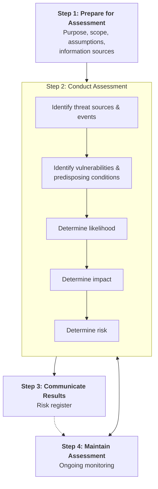

# 2. Methodology

[← Incident Overview](01-incident-overview.md) · [Next: System Characterisation →](03-system-characterisation.md)

## Why NIST SP 800-30 Rev. 1?

This assessment follows **NIST SP 800-30 Rev. 1 — Guide for Conducting Risk Assessments**. It fits this case well because the Equifax breach came from identifiable and preventable conditions — an unpatched vulnerability, a scan that missed it, plaintext credential storage and a broken monitoring system — each of which maps cleanly onto the framework's structured steps.

## The Process

*Adapted from NIST SP 800-30 Rev. 1, Figure 5 (Risk Assessment Process).*

## How Each Step Was Applied

| Step | Application to the Equifax case |
|------|---------------------------------|
| **1. Prepare** | Scope set around the ACIS dispute portal and related database infrastructure. US-CERT advisories and the CVE database used as primary threat information sources. Time horizon: the 12 months before public disclosure. |
| **2. Conduct** | Threat source identified (nation-state actor, PLA Unit 54398) along with threat events such as exploitation of CVE-2017-5638. Vulnerabilities mapped with their predisposing conditions — unpatched Struts 2, plaintext credentials, no encryption at rest, expired SSL certificate. Likelihood and impact scored; all five risks rated Critical. |
| **3. Communicate** | Findings organised into a risk register linking each risk to existing controls, recommended mitigations (NIST SP 800-53 and CIS Controls v8.1) and residual risk. |
| **4. Maintain** | Ongoing monitoring built into each treatment, targeting the patch verification gap, certificate lifecycle failure and missing database activity monitoring. |

## Scoring Criteria

### Likelihood and Impact (1–5)

| Score | Likelihood | Confidentiality Impact | Integrity Impact | Availability Impact |
|:-----:|------------|------------------------|------------------|---------------------|
| 1 | Rare | No disclosure | No corruption | No disruption |
| 2 | Unlikely | Limited disclosure | Minor corruption | Minor disruption |
| 3 | Possible | Moderate disclosure | Moderate corruption | Moderate disruption |
| 4 | Likely | Significant disclosure | Significant corruption | Significant disruption |
| 5 | Almost Certain | Catastrophic disclosure | Severe corruption | Total disruption |

### Risk Rating

**Risk Score = Likelihood × Impact** (range 1–25)

| Score | Rating |
|:-----:|--------|
| 1–5 | 🟢 Low |
| 6–10 | 🟡 Medium |
| 11–16 | 🟠 High |
| 17–25 | 🔴 Critical |
