# 6. Risk Register & Treatment (Steps 3 & 4)

[← Risk Analysis](05-risk-analysis.md) · [Next: Lessons Learned →](07-lessons-learned.md)

Each risk is linked to its asset, threat, vulnerability and existing controls, with mitigations mapped to **NIST SP 800-53 Rev. 5** and **CIS Controls v8.1**. All five risks are treated with **Mitigate**.

> A machine-readable version of this register is in [`data/risk-register.csv`](../data/risk-register.csv).

---

## R1 — Unpatched Software Vulnerability

| Field | Detail |
|-------|--------|
| **Risk statement** | Remote code execution via unpatched Apache Struts 2 may lead to full compromise of the ACIS dispute portal, giving the attacker an initial foothold in Equifax's internal network |
| **Asset** | A02 — Apache Struts Web Application (ACIS) |
| **Threat** | T1190 Exploit Public-Facing Application (PLA Unit 54398) |
| **Vulnerability** | CVE-2017-5638 (CVSS 9.8); CWE-755 |
| **Inherent risk** | L5 × I5 = **25 🔴 Critical** |
| **Existing controls** | Vulnerability scanning programme; US-CERT notification received; internal patch email sent |

| # | Recommended Mitigation | NIST 800-53 | CIS v8.1 |
|:-:|------------------------|:-----------:|:--------:|
| 1 | **Automated patch management** — critical CVEs patched within 72 hours of vendor advisory | SI-2 | 7.4 |
| 2 | **Web Application Firewall** to block malicious `Content-Type` header payloads (virtual patching) | SC-7 | 13.10 |
| 3 | **Verified remediation tracking** — rescan to confirm patches are actually applied | RA-5 | 7.7 |

**Residual risk:** L2 × I5 = **10 🟡 Medium — Not accepted.** Even with patching and a WAF, impact stays severe because ACIS is the primary entry point to the internal network and every downstream asset.

---

## R2 — Missing Encryption at Rest

| Field | Detail |
|-------|--------|
| **Risk statement** | Mass exfiltration over undetected encrypted channels may expose ~147.9M consumer PII records, including SSNs, dates of birth and addresses, over a 76-day period |
| **Asset** | A01 — Consumer PII Database |
| **Threat** | T1048 Exfiltration Over Alternative Protocol |
| **Vulnerability** | CWE-311 Missing Encryption of Sensitive Data |
| **Inherent risk** | L4 × I5 = **20 🔴 Critical** |
| **Existing controls** | Some access controls on database servers; information security programme |

| # | Recommended Mitigation | NIST 800-53 | CIS v8.1 |
|:-:|------------------------|:-----------:|:--------:|
| 1 | **Encrypt all PII at rest** using AES-256 | SC-28 | 3.11 |
| 2 | **Deploy DLP** alerting on bulk exports above defined thresholds | SC-7(10) | 3.13 |
| 3 | **Strict egress allow-listing** on database outbound traffic to approved destinations only | SC-7 | 4.4 |

**Residual risk:** L2 × I4 = **8 🟡 Medium — Not accepted.** Consumer PII remains highly sensitive; any successful bypass would still expose millions of records.

---

## R3 — Plaintext Credential Storage & Flat Network

| Field | Detail |
|-------|--------|
| **Risk statement** | Theft of credentials from a plaintext configuration file may enable lateral movement across an unsegmented network, giving access to 48 databases unrelated to the initially compromised system |
| **Asset** | A04 — Internal Credentials File |
| **Threat** | T1552.001 Credentials In Files → T1078 Valid Accounts |
| **Vulnerability** | CWE-256 Plaintext Storage of a Password; CWE-284 Improper Access Control |
| **Inherent risk** | L5 × I4 = **20 🔴 Critical** |
| **Existing controls** | Access control policies existed on paper only; ACIS environment had defined boundaries |

| # | Recommended Mitigation | NIST 800-53 | CIS v8.1 |
|:-:|------------------------|:-----------:|:--------:|
| 1 | **Secrets management** (e.g. HashiCorp Vault) for encrypted credential storage | IA-5 | 3.11 |
| 2 | **Network segmentation** — ACIS in its own DMZ with no direct path to unrelated databases | SC-7 | 12.2 |
| 3 | **Micro-segmentation and least privilege** with identity-based access controls | AC-3, AC-6 | 6.8 |

**Residual risk:** L2 × I3 = **6 🟡 Medium — Not accepted.** Without full zero-trust architecture across internal systems, some lateral movement risk remains, which is unacceptable given the volume of sensitive data reachable.

---

## R4 — Expired Security Certificate

| Field | Detail |
|-------|--------|
| **Risk statement** | An expired SSL/TLS certificate on the traffic inspection appliance may leave IDS/IPS ineffective for months, allowing malicious traffic to pass uninspected throughout a breach |
| **Asset** | A05 — SSL/TLS Inspection Appliance (SSLV) |
| **Threat** | Control failure (not attacker-initiated) — enabled all other techniques to go undetected |
| **Vulnerability** | CWE-693 Protection Mechanism Failure |
| **Inherent risk** | L5 × I5 = **25 🔴 Critical** |
| **Existing controls** | SSLV appliance procured and installed; IDS and IPS behind the appliance |

| # | Recommended Mitigation | NIST 800-53 | CIS v8.1 |
|:-:|------------------------|:-----------:|:--------:|
| 1 | **Automated certificate lifecycle management** with 60-day expiry alerts | SC-12 | — ¹ |
| 2 | **Certificate inventory and quarterly audit** covering all security infrastructure | CM-8 | 1.1 ¹ |
| 3 | **Redundant traffic inspection** as a compensating control when the primary device fails | SI-4 | 13.3 |

¹ CIS Controls v8.1 has no safeguard dedicated to certificate lifecycle management; asset inventory (1.1) is the closest supporting safeguard.

**Residual risk:** L1 × I5 = **5 🟢 Low — Accepted.** Automated certificate management directly removes the condition that caused ~19 months of blind monitoring, and redundant inspection covers device failure.

---

## R5 — Weak Database Authentication (No MFA)

| Field | Detail |
|-------|--------|
| **Risk statement** | Unauthorised database access using compromised credentials, without multi-factor authentication, may lead to exfiltration of 209,000 payment card records |
| **Asset** | A03 — Payment Card Database |
| **Threat** | T1078 Valid Accounts |
| **Vulnerability** | CWE-308 Use of Single-factor Authentication; CWE-284 Improper Access Control |
| **Inherent risk** | L4 × I5 = **20 🔴 Critical** |
| **Existing controls** | Password policies in some form; some database access controls |

| # | Recommended Mitigation | NIST 800-53 | CIS v8.1 |
|:-:|------------------------|:-----------:|:--------:|
| 1 | **Enforce MFA** on all privileged database administrator accounts | IA-2(1) | 6.5 |
| 2 | **Mandatory default credential change** enforced at deployment | IA-5 | 4.7 |
| 3 | **Database Activity Monitoring (DAM)** to detect anomalous bulk queries in real time | AU-6, SI-4 | 8.5 |

**Residual risk:** L2 × I5 = **10 🟡 Medium — Not accepted.** Payment card data carries PCI DSS obligations and impact remains severe until DAM and privileged access management are fully operational.

---

## Treatment Summary

| Risk | Treatment | Inherent | Residual | Accepted? |
|------|-----------|:--------:|:--------:|:---------:|
| R1 | Mitigate | 🔴 25 | 🟡 10 | ❌ |
| R2 | Mitigate | 🔴 20 | 🟡 8 | ❌ |
| R3 | Mitigate | 🔴 20 | 🟡 6 | ❌ |
| R4 | Mitigate | 🔴 25 | 🟢 5 | ✅ |
| R5 | Mitigate | 🔴 20 | 🟡 10 | ❌ |

```mermaid
xychart-beta
    title "Inherent vs Residual Risk Score"
    x-axis [R1, R2, R3, R4, R5]
    y-axis "Risk score" 0 --> 25
    bar [25, 20, 20, 25, 20]
    bar [10, 8, 6, 5, 10]
```

*Taller bars = inherent risk; shorter bars = residual risk after treatment.*
